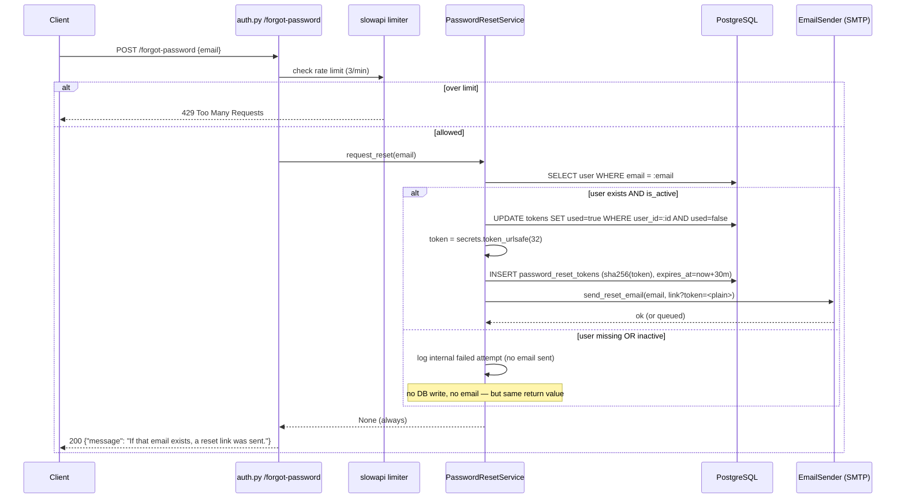
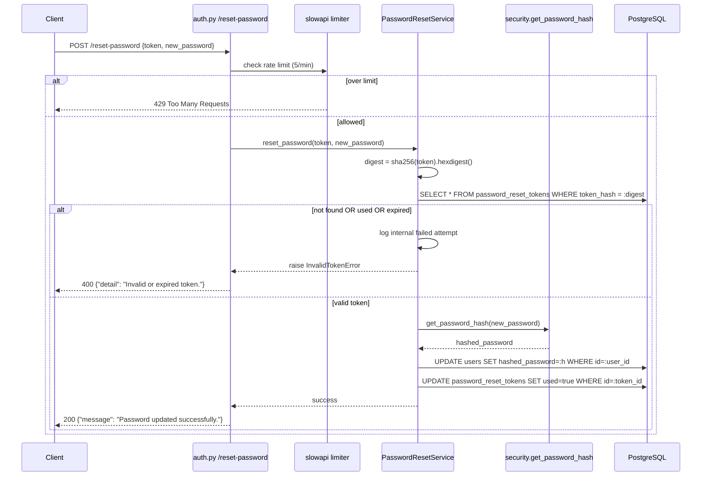

# Design: Password Reset via Email

**Change**: password-reset-email  
**Status**: DRAFT  
**Created**: 2026-06-02

## Architecture Overview

The feature adds a two-endpoint, token-based password reset flow to the existing
auth router. It introduces one new table, one token service, and a provider-agnostic
email layer. Auth (`/register`, `/login`) and existing security helpers are reused, not
modified.

The architecture follows the existing layering convention: **router → service → infrastructure**.
The router owns HTTP concerns (validation, rate limiting, uniform responses), the service
owns business rules (token lifecycle, password update), and the `EmailSender` abstraction
isolates the SMTP infrastructure so the provider is swappable via configuration only.

```
HTTP Client (Flutter / browser at kitchy.vonlunant.site)
    │
    ▼
app/routers/auth.py
    ├─ POST /forgot-password   (@limiter.limit "3/minute")
    │     │
    │     ▼
    │   PasswordResetService.request_reset(email)
    │     ├─ lookup user (no enumeration leak)
    │     ├─ invalidate previous tokens for user
    │     ├─ generate token (secrets.token_urlsafe(32))
    │     ├─ persist sha256(token) in password_reset_tokens
    │     └─ EmailSender.send_reset_email(email, reset_link)
    │           │
    │           ▼
    │        SmtpEmailSender ──► SMTP relay (Resend / docker-mailserver)
    │
    └─ POST /reset-password    (@limiter.limit "5/minute")
          │
          ▼
        PasswordResetService.reset_password(token, new_password)
          ├─ validate sha256(token) against stored hash
          ├─ check expiry + used flag
          ├─ get_password_hash(new_password)   (reused from security.py)
          ├─ update User.hashed_password
          └─ mark token used
```

### New / Modified Files

| File | Status | Responsibility |
|------|--------|----------------|
| `app/models/password_reset_token.py` | NEW | `PasswordResetToken` SQLAlchemy model |
| `app/services/email/base.py` | NEW | `EmailSender` abstract interface |
| `app/services/email/smtp.py` | NEW | `SmtpEmailSender` (aiosmtplib / fastapi-mail) |
| `app/services/password_reset_service.py` | NEW | Token lifecycle + password update logic |
| `app/schemas/auth.py` (or existing schemas module) | MODIFIED | `ForgotPasswordRequest`, `ResetPasswordRequest` |
| `app/routers/auth.py` | MODIFIED | Two new endpoints |
| `app/core/config.py` | MODIFIED | SMTP + reset settings |
| `alembic/versions/<rev>_add_password_reset_tokens.py` | NEW | Migration for the new table |

## Data Model

### Table: `password_reset_tokens`

| Column | Type | Constraints | Notes |
|--------|------|-------------|-------|
| `id` | UUID | PK, default `uuid4` | Row identifier |
| `user_id` | UUID | FK → `users.id`, NOT NULL, ON DELETE CASCADE | Owner of the token |
| `token_hash` | VARCHAR(64) | NOT NULL, INDEXED | `sha256(plain_token)` hex digest (64 chars) |
| `expires_at` | TIMESTAMP (tz) | NOT NULL | `created_at + 30 minutes` |
| `used` | BOOLEAN | NOT NULL, default `false` | Single-use flag |
| `created_at` | TIMESTAMP (tz) | NOT NULL, default `now()` | Issue time |

**Indexes**:
- `ix_password_reset_tokens_token_hash` on `token_hash` — fast lookup at validation time.
- `ix_password_reset_tokens_user_id` on `user_id` — fast invalidation of previous tokens.

The plain token is NEVER stored. Only its sha256 digest is persisted.

### Model definition

```python
# app/models/password_reset_token.py
import uuid
from datetime import datetime
from sqlalchemy import Boolean, DateTime, ForeignKey, String
from sqlalchemy.dialects.postgresql import UUID
from sqlalchemy.orm import Mapped, mapped_column
from app.models.base import Base  # follow existing Base import

class PasswordResetToken(Base):
    __tablename__ = "password_reset_tokens"

    id: Mapped[uuid.UUID] = mapped_column(
        UUID(as_uuid=True), primary_key=True, default=uuid.uuid4
    )
    user_id: Mapped[uuid.UUID] = mapped_column(
        UUID(as_uuid=True),
        ForeignKey("users.id", ondelete="CASCADE"),
        nullable=False,
        index=True,
    )
    token_hash: Mapped[str] = mapped_column(
        String(64), nullable=False, index=True
    )
    expires_at: Mapped[datetime] = mapped_column(DateTime(timezone=True), nullable=False)
    used: Mapped[bool] = mapped_column(Boolean, nullable=False, default=False)
    created_at: Mapped[datetime] = mapped_column(
        DateTime(timezone=True), nullable=False, server_default=func.now()
    )
```

### Alembic migration

```python
# alembic/versions/<rev>_add_password_reset_tokens.py
def upgrade() -> None:
    op.create_table(
        "password_reset_tokens",
        sa.Column("id", postgresql.UUID(as_uuid=True), primary_key=True),
        sa.Column("user_id", postgresql.UUID(as_uuid=True),
                  sa.ForeignKey("users.id", ondelete="CASCADE"), nullable=False),
        sa.Column("token_hash", sa.String(length=64), nullable=False),
        sa.Column("expires_at", sa.DateTime(timezone=True), nullable=False),
        sa.Column("used", sa.Boolean(), nullable=False, server_default=sa.false()),
        sa.Column("created_at", sa.DateTime(timezone=True),
                  server_default=sa.func.now(), nullable=False),
    )
    op.create_index("ix_password_reset_tokens_token_hash",
                    "password_reset_tokens", ["token_hash"])
    op.create_index("ix_password_reset_tokens_user_id",
                    "password_reset_tokens", ["user_id"])

def downgrade() -> None:
    op.drop_index("ix_password_reset_tokens_user_id", table_name="password_reset_tokens")
    op.drop_index("ix_password_reset_tokens_token_hash", table_name="password_reset_tokens")
    op.drop_table("password_reset_tokens")
```

## EmailSender Interface

The email-sending capability is hidden behind an abstract interface. The router and the
reset service depend on `EmailSender`, never on SMTP details. This is the key
swappability boundary: moving from Resend-over-SMTP to a self-hosted `docker-mailserver`
is a configuration change against the same `SmtpEmailSender`, and adding a future
API-based provider (e.g. an HTTP API) is a new implementation with zero changes to
callers.

```python
# app/services/email/base.py
from abc import ABC, abstractmethod

class EmailSender(ABC):
    @abstractmethod
    async def send_reset_email(self, to_email: str, reset_link: str) -> None:
        """Send a password reset email. Raises EmailSendError on failure."""
        ...
```

```python
# app/services/email/smtp.py
import aiosmtplib
from email.message import EmailMessage
from app.services.email.base import EmailSender
from app.core.config import settings

class SmtpEmailSender(EmailSender):
    async def send_reset_email(self, to_email: str, reset_link: str) -> None:
        message = EmailMessage()
        message["From"] = settings.MAIL_FROM
        message["To"] = to_email
        message["Subject"] = "Reset your Kitchy password"
        message.set_content(
            f"Click the link to reset your password:\n{reset_link}\n\n"
            f"This link expires in 30 minutes. If you did not request this, ignore it."
        )
        await aiosmtplib.send(
            message,
            hostname=settings.SMTP_HOST,
            port=settings.SMTP_PORT,
            username=settings.SMTP_USER,
            password=settings.SMTP_PASSWORD,
            start_tls=True,
        )
```

**Why the abstraction**: zero provider lock-in. The proposal mandates the ability to
move off a managed relay to self-hosted mail without code changes. By depending on the
interface, all callers stay stable; the wiring point (a FastAPI dependency that returns
`SmtpEmailSender()`) is the only place that names the concrete class.

## Sequence Diagrams

### (a) Forgot Password — including non-existent / inactive user

The critical property here is **uniform response**: the branch where the user does not
exist (or is inactive) produces the SAME response and timing characteristics as the
success branch, so an attacker cannot enumerate accounts.



### (b) Reset Password — token validation + password change



## Config Changes

New settings in `app/core/config.py` (Pydantic `Settings`, `extra="ignore"`, loaded from `.env`):

```python
class Settings(BaseSettings):
    # ... existing settings ...

    # SMTP / email provider (provider-agnostic, selected via env)
    SMTP_HOST: str
    SMTP_PORT: int = 587
    SMTP_USER: str
    SMTP_PASSWORD: str
    MAIL_FROM: str  # e.g. "Kitchy <no-reply@vonlunant.site>"

    # Password reset
    RESET_TOKEN_TTL_MINUTES: int = 30
    RESET_LINK_BASE_URL: str = "https://kitchy.vonlunant.site/reset-password"
```

Initial `.env` values target Resend over SMTP (`SMTP_HOST=smtp.resend.com`). Switching to
`docker-mailserver` later means changing only these env vars.

### Reset link contract

The email embeds:

```
https://kitchy.vonlunant.site/reset-password?token=<plain_token>
```

- Built as `f"{settings.RESET_LINK_BASE_URL}?token={plain_token}"`.
- The host is served via Cloudflare Tunnel.
- The frontend (out of scope here) reads `token` from the query string and submits it
  with the new password to `POST /reset-password`.

## Token Hashing

**Decision: store `sha256(plain_token)` (hex digest), NOT bcrypt.**

Rationale:

- The token is generated with `secrets.token_urlsafe(32)` → 32 bytes ≈ 256 bits of
  entropy. It is unguessable by brute force. The reason to hash a *password* with bcrypt
  is that passwords are low-entropy and need a deliberately slow, salted KDF to resist
  offline cracking. That threat does not apply to a 256-bit random token.
- A fast hash (sha256) is therefore sufficient: even with the database leaked, an attacker
  cannot reverse sha256 of a 256-bit random input, and the token is single-use and expires
  in 30 minutes.
- sha256 produces a fixed 64-char hex digest, enabling a simple `String(64)` column and a
  direct **indexed equality lookup** — bcrypt's per-row random salt would force a full scan
  plus a `verify()` per candidate row, which is both slower and breaks the index strategy.

This mirrors the standard practice for high-entropy bearer tokens (session tokens, API
keys): hash with a fast digest at rest; reserve bcrypt for human-chosen secrets.

## Security Considerations

| Concern | Mitigation |
|---------|------------|
| **User enumeration** | `/forgot-password` returns an identical 200 + generic message for existing, missing, and inactive users. No timing fork that skips meaningful work (see diagram (a)). |
| **Token leakage at rest** | Only `sha256(token)` is stored; the plain token lives only in the email and the URL. |
| **Token guessing** | 256-bit `secrets.token_urlsafe(32)` — cryptographically random, not brute-forceable. |
| **Token replay / reuse** | `used` flag enforces single-use; consumed on successful reset. |
| **Stale tokens** | `expires_at = created_at + 30 min`; expiry checked at validation. |
| **Multiple outstanding tokens** | Requesting a new token marks all prior unused tokens for that user as `used`. |
| **Comparison timing** | Validation is an indexed equality lookup on the sha256 digest. Since both sides are fixed-length sha256 digests of high-entropy input, this is not a meaningful timing oracle; if a direct in-memory comparison is ever added, use `hmac.compare_digest`. |
| **Brute force / abuse** | Rate limits via existing `slowapi`: `/forgot-password` 3/min, `/reset-password` 5/min. Failed attempts logged internally (never surfaced to the client). |
| **Password strength** | New password reuses the existing register-time validation and `get_password_hash` from `security.py` — no divergent hashing path. |
| **Inactive accounts** | Treated identically to non-existent at the response layer; no reset email sent. |

## Edge Cases

| Scenario | Handling |
|----------|----------|
| Email not registered | Uniform 200; no token, no email; internal log. |
| Inactive user | Uniform 200; no token, no email; internal log. |
| Expired token at reset | 400 "Invalid or expired token". |
| Already-used token | 400 "Invalid or expired token" (same message, no info leak). |
| Token for deleted user | FK `ON DELETE CASCADE` removes orphan tokens. |
| SMTP failure | `EmailSendError` logged internally; client still gets the uniform 200 (avoid leaking provider state / enumeration). |
| Multiple reset requests | Latest token wins; previous ones invalidated. |

---

*See spec.md for behavioral requirements and tasks.md for the implementation breakdown.*
